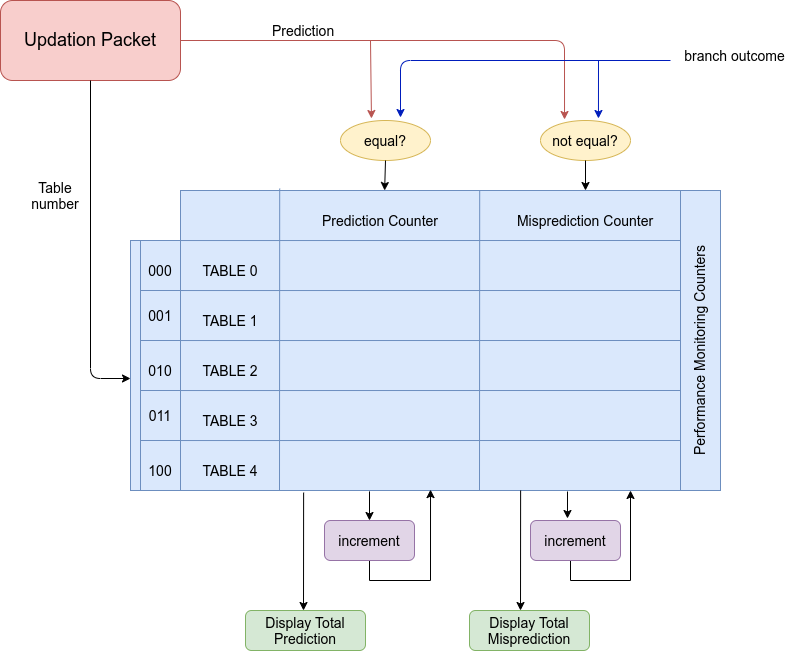

[TOC]


# Chapter 1

# TAGE Branch Predictor Algorithm

Tagged Geometric (TAGE) History length is a conditional branch predictor that makes use of several predictor components or predictor tables. It uses geometric history length as in OGEHL predictor and (partially) tagged tables as in PPM-like predictor. (They are different efficient predictors from which TAGE was derived)

## 1.1 Architecture

TAGE consists of two types of predictors - bimodal table predictor and tagged table predictors.

| Predictor Name                           | Function                                                   | Fields in Each Entry of Table                                |
| ---------------------------------------- | ---------------------------------------------------------- | ------------------------------------------------------------ |
| Bimodal Predictor (T0)                   | In charge of providing basic prediction                    | 2 bit saturation counter                                     |
| Tagged Table Predictors (T1, T2, T3, T4) | In charge of providing prediction in the case of tag match | 3 bit signed saturation counter, Unsigned Usefulness 2 bit Counter, Tag |


The below figure shows the architecture of TAGE as described above. 


### Bimodal Table Predictor

The bimodal predictor is a simple PC-indexed 2-bit counter table which gives the prediction when all the tagged table predictors cannot. The MSB bit of the PC indexed counter is the prediction bit.

Each counter in the base predictor table works as saturating counter. Increments if branch is TAKEN, Decrements if branch NOT TAKEN. Saturates at 00 or 11.

### Tagged Table Predictors

Each entry in the Tagged table predictor consists of 3 bit prediction counter (ctr), tag and 2 bit usefulness u counter. If there is a tag match, that predictor will be considered for final prediction.

### Program Counter (PC)

The current branch address is stored in the Program Counter. It plays a significant role in obtaining the path history which needs to be stored in the Path History Register(PHR).

### Final Prediction

Final Prediction is the one bit output that is required from any branch predictor. It needs to come in sync with the actual branch outcome.

### Global History Register (GHR)

Global History Register stores the actual outcome (in case of non speculative updation) or final prediction (in case of speculative updation) of the last N branches. Here, N is the number of bits of Global History Register.

### Index Computation and Tag Computation Functions

Index and Tag are obtained by the hashing of PC and Global History Register(GHR). But the hashing functions used are differnt. There are different hashing functions available. The aim of hashing is to down convert the index length to the required target length which can take up different combinations of PC and GHR. Also, using XOR hashing function reduces aliasing. The tags are also calculated and changed to smaller target lengths.


## 1.2 Prediction Computation

For prediction computation, it is important to get a tag match. Using PC ( also PHR ) and GHR, the index of each table predictor entry as well as the tag for each tagged table predictors are calculated. The entry mapped to index, also the one which has a tag match is considered for final prediction. Those entries which has a tag match are considered. This is explained in the below figure:


There may be more than predictors having the same tag, so the predictor having the longest history must be considered and the second longest as the alternate predictor. The flowchart for selecting the provider component is as shown:


## 1.3 Updation of Table Predictors

At update time( for instance at instruction retirement), we know that the prediction from bank X ∈ [0, 4] it was obtained and whether the prediction was correct or not.

**Update 3-bit counter ctr**: The 3 bit counter on bank X, the one provided the final prediction and only that counter is updated. This is how it is done: the counter is incremented if the branch is taken, decremented otherwise, and it saturates at values 7 and 0. In general, people prefer to use 2-bit counter instead of 3 bit counters. However, 3 bit counters generate less misprediction.


**Updating the useful counter u**: The useful counter *u* of the provider component is updated when the alternate prediction *altpred* is different from the final prediction *pred*. *u* is incremented when the actual prediction *pred* is correct and decremented otherwise.


**Update on a correct prediction**: The prediction counter of the provider component is updated.

**Updating the GHR and PHR**: The GHR and PHR are updated speculatively with the prediction and branch address respectively. At the reconstruction of GHR and PHR, when the branch is actually resolved, a check pointing mechanism is used. That is, the stored GHR and PHR in the updation packet for the resolved branch is used to update the internal GHR and PHR, if there is a misprediction. If there is no misprediction, then there is no need of reconstruction as the speculatively updated internal GHR and PHR are correct and need not invalidate.


# Chapter 2

# Experimental Framework

Instruction traces from Championship Branch Predictor(CBP) are used to evaluate the design done in Bluespec System Verilog. Championship Branch Prediction (CBP) is a branch predictor competition to evaluate and compare branch prediction algorithms in a common framework. In the evaluation framework, a GShare predictor of size 64Kb is implemented to do the comparisons with the competitors’ predictors. The same GShare predictor is used for comparing the TAGE design done in this project. TAGE and GShare predictor is evaluated with some instruction traces from CBP.

The traces is approximately 30 million instructions long and includes both user and system activity. The traces used are in the category of SPECfp and SPECint.

## 2.1 GShare Predictor 

The GShare predictor used for comparison, whose hardware description has been done in C language, which was used to analyse the accuracy values for different predictor sizes. As for the Championship Branch Predictor Competition, GShare predictor with 16 bits Branch History Register(BHR) and table size of 64Kb is used to compare with the competitors’ predictors. And the indexing of GShare Branch History table is done by simple XOR operation between global branch history and branch address. Since the table size is very large, there will be more entries for different branches to map to. Each entry contains a prediction counter of 2 bits.


## 2.2 Simulation Setup

The below figure shows the Bluespec Simulation setup for analysing the performance of TAGE for different traces. The block TAGE predictor is instantiated in the testbench where the traces, PC are given as input as well as the simulation flow of control is written. Once the inputs are given
through testbench to the predictor, the predictor will give the prediction in the next cycle. The logic for misprediction is written by comparing the actual outcome of a particular branch in the trace. Misprediction logic is written in testbench with the assumption that in a real scenario the processor will give the misprediction bit included in the updation packet, after the branch gets resolved. Once the updation packet is obtained, it can be used in updating the GHR and PHR as well as perform the TAGE updation algorithm. From the next cycle onwards, both prediction of current branch and updation of the previous branch happen simultaneously. Each time, when there is prediction or misprediction, the corresponding predictor tables from which this prediction bit is obtained is logged into the performance counters in the testbench. This gives an idea about the total number of tag hits from each table predictors, correct predictions and wrong predictions from each table predictors.


## 2.3 Testbench flow

The trace file here depicts two files, namely file containing branch address and another file containing its corresponding branch outcome. The branch address is given as program counter, which is one of the inputs of TAGE, through testbench.

The output from the TAGE predictor, which is the prediction packet, is stored in the updation packet after certain modifications. The misprediction is checked by comparing the actual outcome from trace file and prediction in the prediction packet. This information is added to the updation packet and given as input to the TAGE predictor for updating the table predictors fields.


## 2.4 Performance Monitoring Counters

The performance monitoring counters inside the Testbench make record of the total number of correct predictions and mispredictions from each table predictors.




The performance monitoring counters for each table predictors constitute total number of correct predictions and incorrect predictions from each table predictors. And overall performance counters constitute the overall correct prediction and overall incorrect prediction of the TAGE predictor as a whole. This is done by incrementing each performance counter after comparison of prediction and branch outcome. If the prediction and branch outcome are equal, then the predictor table from which this prediction has occurred is noted and the corresponding correct prediction counter of that table is incremented. If the prediction and branch outcome are not equal, then the predictor table from which this prediction has occurred is noted and the corresponding incorrect prediction counter of that table is incremented. The overall correct prediction and incorrect prediction counters of TAGE, are incremented based on total predictions and mispredictions of TAGE. At the end of each simulation of design for a trace, the performance monitoring counters of each table predictors and overall performance counters are displayed. This is done for four traces from Championship Branch Predictor Tournament.
Accuracy is given by,
$$
Accuracy = correctprediction ∗ 100 /(correctprediction + incorrectprediction)
$$
MPKI is given by,

The accuracy obtained for each trace is calculated using the above formula for accuracy. This
is repeated for different TAGE sizes and plotted on graph for analysis.


$$
MispredictionsperKiloInstructions(MPKI) = incorrectprediction ∗ 1000 / totalinstructions
$$

The accuracy obtained for each trace is calculated using the above formula for accuracy. This
is repeated for different TAGE sizes and plotted on graph for analysis.


# Chapter 3

# Simulation Results

## 3.1 Analysis by changing different TAGE parameters

### Analysis based on different lengths of GHR

The TAGE predictor uses a geometric series of history lengths which allows to use very long history lengths for indexing some predictor tables, while still dedicating most of the storage space to predictor tables using shorter global history lengths. And hence to index, geometric length of 130 bits and 200 bits were analysed for two different traces with different PHRs. And found out that there is only marginal difference in the accuracy for the two. Hence, chosen 130 bits of GHR for optimum design considering small storage budget.


### Analysis based on different tag lengths

Different tag lengths of 8,9 and 9,10 were analysed with two of the traces and found there is
not much difference in the accuracy. And hence, tag bits of 8,9 lengths are used in the optimum
design.


### Analysis based on different PHR lengths

There is variation in the accuracy of TAGE for DIST-INT-1 trace when PHR lengths are varied from 8 bits, 16 bits and 32 bits. Beyond 32 bits, it saturates and the accuracy does not increase.


Whereas for DIST-FP-2 trace, there is no much variations in the accuracies for different PHRs.


## 3.2 Comparison of TAGE with GShare predictor

Line graph in blue shows the present TAGE design for 55,459 bits storage.

Line graph in red shows the previous TAGE design for 59,392 bits storage.

Line graph in green shows the GShare from Championship Branch Predictor Tournament for 65,536 bits storage.


# Chapter 4 

# Code Documentation


## `parameter.bsv`

The below table explains the different parameters used in the hardware design files of TAGE, divided into three sections for:

1. Simulations : change the values as per preference
2. Analysis: change the values for different bit sizes
3. Hardware specific: change the values only if needed, dependent on the TAGE architecture


### 1. Simulations

This is for simulations in bluesim using the obtained traces.

| Parameter Name | Function                                                     | Usage                                 |
| -------------- | ------------------------------------------------------------ | ------------------------------------- |
| `traceSize`    | Total number of traces (conditional branch instructions) in the trace files. | provide the number of traces as value |
| `DISPLAY`      | Displays the simulation result in the terminal               | comment if not needed                 |
| `DEBUG`        | For debugging, displays the necessary field values           | comment if not needed                 |

### 2. Analysis

Change the design values as needed.

| Parameter Name | Function                                                     | Usage                    |
| -------------- | ------------------------------------------------------------ | ------------------------ |
| `NUMTAGTABLES` | Number of Tagged Predictor tables in TAGE structure          | Design value : 4         |
| `TABLESIZE`    | Size of each Tagged Table predictors                         | Design value : 1024      |
| `BIMODALSIZE`  | Size of Bimodal Table Predictor                              | Design Value : 1024      |
| `TAG1_SIZE`    | Tag lengths of Tagged tables T0 and T1                       | Design value : 8         |
| `TAG2_SIZE`    | Tag lengths of Tagged tables T2 and T3                       | Design values : 9        |
| `GHR1`         | GHR bits accessed by Tagged Table T0                         | Design value : 5         |
| `GHR2`         | GHR bits accessed by Tagged Table T1                         | Design value : 15        |
| `GHR3`         | GHR bits accessed by Tagged Table T2                         | Design value : 44        |
| `GHR4`         | GHR bits accessed by Tagged Table T1                         | Design value : 130       |
| `BIMODAL_LEN`  | The target bit length of index to access the bimodal table predictor | Design value : 10 (1024) |
| `TABLE_LEN`    | The target bit length of index to access the tagged predictor tables | Design value : 10 (1024) |
| `PHR_LEN`      | The length of the Path History Register                      | Design value : 32        |

### 2. Hardware Specific

Change the below parameters only if needed, dependent on the TAGE architecture

| Parameter Name     | Function                                              | Usage             |
| ------------------ | ----------------------------------------------------- | ----------------- |
| `PC_LEN`           | Number of PC Bits                                     | For 64 bits PC    |
| `BIMODAL_CTR_LEN`  | Number of bits in Prediction counter of Bimodal Table | Design Value : 2  |
| `TAGTABLE_CTR_LEN` | Number of bits in Prediction Counter of Tagged Table  | Design Value : 3  |
| `U_LEN`            | Number of bits in Usefulness Counter of Tagged Table  | Design Value : 2  |
| `OUTCOME`          | Actual branch outcome, that is 1 bit                  | Design Value : 1  |
| `PRED`             | Prediction, that is 1 bit                             | Design Value : 1  |
| `GEOM_LEN`         | To specify the integer value for GHR bits             | Design Value : 32 |
| `TARGET_LEN`       | To specify the integer value for Target length bits   | Design Value : 32 |


## `Type_TAGE.bsv`

The file contains all the user defined types for the TAGE hardware structure. Also, included the function for calculating the index of table predictors and the tags of Tagged Table predictors.

| Type Name         | Function                                                     | Remarks                             |
| ----------------- | ------------------------------------------------------------ | ----------------------------------- |
| `Program Counter` | Type of Program Counter                                      | Bit Type                            |
| `Global History`  | Type of Global History Register                              | should be of but length  GHR+1      |
| `TableNo`         | Index of index of each Tagged Table Predictors staring from 0 | 00,01,10,11                         |
| `BimodalIndex`    | Type of index of each entry in Bimodal Predictor Table       | Bit Type                            |
| `TagTableIndex`   | Type of index of each entry in Tagged Table Predictors       | Bit Type                            |
| `BimodalCtr`      | Type of Prediction Counter in Bimodal Predictor Table        | Bit Type                            |
| `TagTableCtr`     | Type of Prediction Counter in Tagged Table Predictor  Tables | Bit Type                            |
| `TableTag1`       | Type of tag1 in Tagged Predictor Tables                      | Bit Type, Tags of T1 and T2 Tables  |
| `TableTag2`       | Type of tag2 in Tagged Predictor Tables                      | Bit Type, Tags of T3 and T4 Tables  |
| `UsefulCtr`       | Type of Usefulness Counter in each Tagged Predictor Tables   | Bit Type                            |
| `ActualOutcome`   | Type of Actual Outcome of Branch Instruction                 | Bit Type                            |
| `Prdiction`       | Type of Prediction from the TAGE Predictor                   | Bit Type                            |
| `AltPrediction`   | Type of Alternate Prediction from the TAGE Predictor         | Bit Type                            |
| `Misprediction`   | Type of Misprediction from the TAGE Predictor                | Bit Type                            |
| `GeomLength`      | Type of Geometric Lengths from each Tagged Predictor Tables  | Bit Type, values can be 5,15,44,130 |
| `TargetLength`    | Type of the target lengths to which the index or tag needs to be converted to | Bit Type                            |
| `PathHistory`     | Type of Path History Register                                | Bit Type                            |

### Defined  Structure Types

| Name           | Type   | Fields                                                       | Remarks                                                      |
| -------------- | ------ | ------------------------------------------------------------ | ------------------------------------------------------------ |
| `Tag`          | Union  | `Tag1`, `Tag2`                                               | Based on the size of initialisation Tags of required size will be chosen |
| `TagEntry`     | Struct | prediction counter (`ctr`), usefulness counter (`uctr`), `tag` | Type of Each entry of Tagged Predictor Tables                |
| `BimodalEntry` | Struct | prediction counter (`ctr`)                                   | Type of Each entry in Bimodal Predictor Table                |

#### Output Structure Type - `PredictionPacket`

| Field Names      | Type                               | Function                                                     |
| ---------------- | ---------------------------------- | ------------------------------------------------------------ |
| `bimodal_index`  | `BimodalIndex`                     | stores index of entry in Bimodal Predictor Table which provided prediction |
| `tagTable_index` | Vector of `TagTableIndex` type     | stores all the entries in tagged predictor indexes which provided prediction |
| `tableTag`       | Vector of `Tag` type               | stores the tags of all entries which provided prediction     |
| `uCtr`           | Vector of Usefulness Counter type  | stores the uCtr of all entries in tagged predictor tables which provided prediction |
| `ctr`            | Vector of Prediction counters type | stores all the prediction counters of entries in predictor tables which provided prediction |
| `ghr`            | `GlobalHistory`                    | stores the GHR used for computing prediction of that branch  |
| `pred`           | `Prediction`                       | stores the prediction of that branch for which the Prediction Packet was made |
| `tableNo`        | `TableNo`                          | stores the table number of the table which gave final prediction |
| `altpred`        | `AltPrediction`                    | stored the alternate prediction, that is prediction from table having second longest history and which has tag match |
| `phr`            | `PathHistory`                      | stored the PHR used for computing prediction of that branch  |

#### Input Updating Structure Type - `UpdationPacket`

The fields in the Updation Packet is same as Prediction Packet used for updating the Table Predictors after obtaining the actual outcome of that branch for which the updation has to be made.

The additional fields required in the `UpdationPacket` are as follows :

| Field Names     | Type            | Function                                                     |
| --------------- | --------------- | ------------------------------------------------------------ |
| `mispred`       | `Misprediction` | stores the prediction is correct or not, 1 for mispredicted and 0 for right prediction |
| `actualOutcome` | `ActualOutcome` | stored the actual outcome of that branch which is obtained at the instruction execution stage |

#### Simulation Structure - `TableCounters`

For counting the number of predictions and mispredictions from each predictor tables.

| Field Name         | Type      | Function                                    |
| ------------------ | --------- | ------------------------------------------- |
| `predictionCtr`    | `Integer` | Stores the number of correction predictions |
| `mispredictionCtr` | `Integer` | Stores the number of incorrect predictions  |

### Functions

Index and Tag calculation make use of two function `computeIndex()` and `computeTag()` functions respectively.

An efficient and better way than folding (dividing) GHR bits in equal parts and XORing is making use of compressed history technique used in Prediction by Partial Matching (PPM) branch predictor paper. The technique is implemented in code as follows:

```
function Bit#(64) compHistFn(GlobalHistory ghr, TargetLength targetlength, GeomLength geomlength);
    Bit#(32) mask = (1 << targetlength) - 32'b1;
    Bit#(32) mask1 = zeroExtend(ghr[geomlength]) << (geomlength % targetlength);
    Bit#(32) mask2 = (1 << targetlength);
    Bit#(32) compHist = 0;
    compHist = (compHist << 1) + zeroExtend(ghr[0]);
    compHist = compHist ^ ((compHist & mask2) >> targetlength);
    compHist = compHist ^ mask1;
    compHist = compHist & mask;
    return zeroExtend(compHist);
endfunction
```

#### `computeIndex()`

Index is computed using `compHistFn()` and XORing the same with PC, PHR and a different combination of both.

```
index = pc ^ (pc >> `TABLE_LEN) ^ comp_hist ^ zeroExtend(phr) ^ (zeroExtend(phr) >> `TABLE_LEN);
```

The above code is for Tagged Table predictor 1. The same goes for other tables but with different GHR length and with a slight variation.

#### `computeTag()`

Tag is also computed using `compHistFn()` and XORing with PC with a different function as shown.

```
 let comp_hist0 = compHistFn(ghr,`TAG2_SIZE, `GHR2);
 let comp_hist1 = compHistFn(ghr,`TAG1_SIZE, `GHR2);
 comp_tag_table = pc ^ comp_hist0 ^ (comp_hist1 << 1);
```


## `Tage_predictor.bsv` 

Bluespec System Verilog code documentation of TAgged GEometric (TAGE) History length branch predictor with 5 table predictors (one bimodal table predictor and four tagged table predictors) indexed with Global History Register(GHR) and Path History Register (PHR).

### TAGE Branch Predictor
The inputs and outputs are specified in the interface to the TAGE Predictor hardware:

    interface Tage_predictor_IFC;
        method  Action computePrediction(ProgramCounter pc);  
        method  Action updateTablePred(UpdationPacket upd_pkt);  
        method PredictionPacket output_packet();  
    endinterface

The variables in the TAGE interface is given below:
| Variable Name | Type  | Function                                          |
| ------------- | ----- | ------------------------------------------------- |
| `pc`          | Input | Program Counter with current branch address       |
| `upd_pkt`     | Input | Updation Packet for updating the table predictors |

Methods in the interface of TAGE hardware is given below : 

| Method              | Type   | Function                                                     |
| ------------------- | ------ | ------------------------------------------------------------ |
| `computePrediction` | Action | Creates prediction packet after some computations based on TAGE algorithm, current branch address is given as input to the method. |
| `updateTablePred`   | Action | Updates the Table predictors based on TAGE algorithm, updation packet is given as input to the method. |
| `out_packet`        | Value  | Outputs the prediction packet after prediction computation.  |

### Structures
The following table describes the hardware structure used:
| Structure Name | Type     | Function                                                     |
| -------------- | -------- | ------------------------------------------------------------ |
| `ghr`          | Register | Global History Register internal to the hardware             |
| `phr`          | Register | Path History Register internal to the hardware               |
| `bimodal`      | RegFile  | Bimodal Table predictor acts as the base/default predictor   |
| `table_0`      | RegFile  | first of four Tagged Table predictors indexed with least long global history |
| `table_1`      | RegFile  | second of four Tagged Table predictors indexed with longer global history than `table_0` |
| `table_2`      | RegFile  | third of four Tagged Table predictors indexed with second longest history |
| `table_3`      | RegFile  | last of four Tagged Table predictors indexed with all of global history |
| `tagTables[4]` | Array    | Array of all tagged table predictors grouped together.       |
| `pred_pkt`     | struct   | Stores the fields including prediction and those which are required for updating the corresponding entry in predictor tables at the time of updation |

The following table includes the Wire structure used for passing values between the rules and methods (between hardware structures):
| Wire Name       | Function                                                     |
| --------------- | ------------------------------------------------------------ |
| `w_ghr`         | wire to pass GHR value from either rule `rl_spec_update` or `rl_spec_update` to `rl_GHR_PHR_write` rule |
| `w_phr`         | wire to pass PHR value from either rule `rl_spec_update` or `rl_spec_update` to `rl_GHR_PHR_write` rule |
| `w_pc`          | wire to pass PC value from `computePrediction` method to `rl_spec_update` rule |
| `w_pred`        | wire to pass prediction value from `computePrediction` method to `rl_spec_update` rule |
| `w_upd_pkt`     | wire to pass updation packet from `updateTablePred` method to `rl_update` rule |
| `w_pred_over`   | wire from `computePrediction` to `rl_spec_update` for indicating prediction is over |
| `w_update_over` | wire from `updateTablePred` to `rl_update` for indicating updation is over |

### Rules
The following table shows the rules for updating the GHR and PHR, speculatively as well as non-speculatively:

| Rule Name                | Predicate                                                    | Function                                                     |
| ------------------------ | ------------------------------------------------------------ | ------------------------------------------------------------ |
| `rl_reconstruct_GHR_PHR` | `w_update_over.whas && w_upd_pkt.whas && w_update_over.wget` | Reconstruct PHR and GHR at the time of updation of Table predictors once the actual outcome of branch has obtained |
| `rl_spec_update_GHR_PHR` | `w_pred_over.whas && w_pred.whas && w_pc.whas && w_pred_over.wget` | Rule to speculatively update GHR and PHR once prediction is made. |
| `rl_GHR_PHR_write`       |                                                              | Rule to write to internal GHR and PHR at both speculation as well as reconstruction |

### Methods
The three methods based on the TAGE algorithm is described as follows:

#### 1. `computePrediction() `

This method computes prediction and the associated fields in the prediction packet. This is made available in the next clock cycle through the `out_packet()` method.

| Variable Name       | Type                                      | Function                                                     |
| ------------------- | ----------------------------------------- | ------------------------------------------------------------ |
| `computedTag[4]`    | Array of Type `Tag` with size 4           | temporarily stores the computed tags using Tag Function for each Tagged table predictors |
| `bimodal_index`     | `BimodalIndex` type                       | temporarily stores the computed index for Bimodal Predictor table using index function |
| `tagTable_index[4]` | Array of Type `TagTableIndex` with size 4 | temporarily stores the computed index for each Tagged table predictors using Index function |
| `t_pred_pkt`        | `PredictionPacket`                        | Stores the prediction packet temporarily, for writing to `pred_pkt` register |
| `t_pred_pkt.phr`    | `PathHistory`                             | temporarily stores the PHR in the field of prediction packet |
| `matched`           | `Bool`                                    | True if there is a tag match in entry from which prediction is considered, False if there is no tag match |
| `altMatched`        | `Bool`                                    | True if there is a tag match in entry from which alternate prediction is considered, False if there is no tag match |

The below code updates the PHR value in temporary `pred_pkt` as soon as the `pc` value is obtained:

```
t_pred_pkt.phr = update_PHR(phr, pc);
```

The update_PHR function takes care of the updation of PHR by taking in value from internal PHR and input PC.

##### Indexing and Tagging

`bimodal_index` is computed and assigned to bimodal_index field in `t_pred_pkt`. The code block is as given below:

    bimodal_index = truncate(computeIndex(pc,ghr,t_pred_pkt.phr,3'b000));
    t_pred_pkt.bimodal_index = bimodal_index;
For each `tagTable_index`, the code block is as shown below:

```
for (Integer i = 0; i < 4; i=i+1) begin
	TableNo tNo = fromInteger(i+1);
    tagTable_index[i] = truncate(computeIndex(pc,ghr,t_pred_pkt.phr,tNo));
    t_pred_pkt.tagTable_index[i] = tagTable_index[i];
    if(i<2) begin
    	computedTag[i] = tagged Tag1 truncate(computeTag(pc,ghr,tNo));
        t_pred_pkt.tableTag[i] = computedTag[i];
    end
    else begin
    	computedTag[i] = tagged Tag2 truncate(computeTag(pc,ghr,tNo));
        t_pred_pkt.tableTag[i] = computedTag[i];
    end
end
```

Based on the table number of Tables, the tags are assigned. For tables with table number, greater than or equal to 2, Tag2 is assigned. For tables with table number, less than 2, Tag1 is assigned. (The keyword `Tagged` is used, since Tag is Union Type.)

##### Check for Tag Match

Initialised the bimodal table predictor as the default predictor as per the algorithm. 

Corresponding fields in `t_pred_pkt` is set according to the bimodal table predictor. The index from which the access should happen has been calculated as per the previous section. As shown below:

    t_pred_pkt.tableNo = 3'b000;
    t_pred_pkt.altpred = bimodal.sub(bimodal_index).ctr[1];
    t_pred_pkt.pred = bimodal.sub(bimodal_index).ctr[1];
    t_pred_pkt.ctr[0] = zeroExtend(bimodal.sub(bimodal_index).ctr);

Also, `matched` and `altMatched` are initialised to `False`, indicating that there has been no tag match and prediction is done by the bimodal table predictor. As shown below:

    Bool matched = False;
    Bool altMatched = False;
Now, for each tagged table predictors iterated from T4 to T0 (from longer history table to shorter history table), once there is tag match from the calculated index as per the previous section, that table entry is considered and updated in the `t_pred_pkt` fields. In such a case, `matched` will be updated to `True`. 

Once `matched` becomes `True`, the second longest history where there is a tag match is considered as alternate prediction. In that case, `altMatched` becomes `True`.

The code is as shown below:

    for (Integer i = 3; i >= 0; i=i-1) begin
    	if(tagTables[i].sub(tagTable_index[i]).tag == computedTag[i] && !matched) begin
    		t_pred_pkt.ctr[i+1] = tagTables[i].sub(tagTable_index[i]).ctr;
        	t_pred_pkt.pred = tagTables[i].sub(tagTable_index[i]).ctr[2];
        	t_pred_pkt.tableNo = fromInteger(i+1); 
        	t_pred_pkt.uCtr[i] = tagTables[i].sub(tagTable_index[i]).uCtr;     matched = True;
    	end
        else if(tagTables[i].sub(tagTable_index[i]).tag == computedTag[i] && matched && !altMatched) begin
        	t_pred_pkt.altpred = tagTables[i].sub(tagTable_index[i]).ctr[2];
            altMatched = True;
        end
    end
The below code is for setting the corresponding wires to rule `rl_spec_update_GHR_PHR` for speculatively updating the internal GHR and PHR in the TAGE hardware:

```
w_pred <= t_pred_pkt.pred;              
w_pc <= pc;
```

Speculative updation of GHR in temporary prediction packet by calling `update_GHR` function after obtaining prediction from tag matched entry.

```
t_pred_pkt.ghr = update_GHR(ghr, t_pred_pkt.pred);
```

Assigning into Register `pred_pkt` with variable `t_pred_pkt` for it to appear between methods:  

```
pred_pkt <= t_pred_pkt;
```

Also, as prediction is over:

```
w_pred_over <= True;
```

This enables the `rl_spec_update_GHR_PHR`.

#### 2. `updateTablePred()`

`upd_pkt` of `UpdationPacket`type is made available as input to the TAGE predictor once the Actual outcome of the corresponding branch is available. The actual outcome and misprediction bit is made available in the Updation Packet ( for simulation purpose, the testbench does this function).

| Variable Name   | Type                                     | Function                                                     |
| --------------- | ---------------------------------------- | ------------------------------------------------------------ |
| `index[4]`      | `TagTableIndex`                          | temporarily stores Tagged Table predictor entry indexes from which prediction was considered and made available in Updation Packet, `upd_pkt` |
| `tagTableEntry` | Array of `TagEntry` type with 4 elements | temporarily stores the Tag entries from Updation Packet, `upd_pkt` |
| `table_tags`    | Array of `Tag` type with 4 elements      | temporarily stores the computed tags from Updation Packet, `upd_pkt` |
| `tagtableNo`    | `TableNo` type                           | stores the number of Tagged table predictors (`upd_pkt.tableNo - 1`) |
| `bimodal_index` | `BimodalIndex`                           | temporarily stores the bimodal index of the entry in Bimodal Table predictor which gave the prediction |
| `bimodalEntry`  | `BimodalEntry`                           | temporarily stores the bimodal entry corresponding to the `bimodal_index` |
| `outcome`       | `ActualOutcome`                          | temporarily stores the actual outcome of particular branch for which the updation has to be made |

##### Storing values from Updation Packet

The below code shows the storing of values from updation packet to temporary variables in order for further computations.

```
BimodalIndex bimodal_index = upd_pkt.bimodal_index;
BimodalEntry bimodalEntry = bimodal.sub(bimodal_index);
for(Integer i=0; i < `NUMTAGTABLES ; i=i+1) begin
	index[i] = upd_pkt.tagTable_index[i];
	tagTableEntry[i] = tagTables[i].sub(index[i]);
    table_tags[i] = upd_pkt.tableTag[i];
end
```

The indexes of each table entries which gave prediction are stored in temporary index variables. Similarly for tags of Tagged table predictors. As shown in code above.

Outcome of branch is stored as follows:

```
ActualOutcome outcome = upd_pkt.actualOutcome;
```

##### Updation of Tagged Table Predictors as per algorithm

Usefulness Counter of entries which gave prediction are updated as ahown below:

    if(upd_pkt.pred != upd_pkt.altpred) begin
    	if (upd_pkt.mispred == 1'b0 && upd_pkt.tableNo != 3'b000)
    		tagTableEntry[tagtableNo].uCtr = upd_pkt.uCtr[tagtableNo] + 2'b1;
        else
            tagTableEntry[tagtableNo].uCtr = upd_pkt.uCtr[tagtableNo] - 2'b1;
    end
If alternate prediction is different from final prediction, and the final prediction is correct, increment `uCtr`, otherwise decrement `uCtr`. Also a check for **not** a bimodal table is also included.

Provider component's prediction counter is incremented if actual outcome is TAKEN and decemented if actual outcome is NOT TAKEN. As shown below:

```
if(upd_pkt.actualOutcome == 1'b1) begin
	if(upd_pkt.tableNo == 3'b000)
		bimodalEntry.ctr = (bimodalEntry.ctr < 2'b11) ? (bimodalEntry.ctr + 2'b1) : 2'b11 ;
    else
        tagTableEntry[tagtableNo].ctr = (upd_pkt.ctr[tagtableNo+1]< 3'b111 )?(upd_pkt.ctr[tagtableNo+1] + 3'b1): 3'b111;
end
else begin
    if(upd_pkt.tableNo == 3'b000)
    	bimodalEntry.ctr = (bimodalEntry.ctr > 2'b00) ? (bimodalEntry.ctr - 2'b1) : 2'b00;
    else
		tagTableEntry[tagtableNo].ctr = (upd_pkt.ctr[tagtableNo+1] > 3'b000)?(upd_pkt.ctr[tagtableNo+1] - 3'b1): 3'b000;
end
```

**Allocation of new entry** :

This part of the code does the allocation of new entry using `allocate_entry()` function if there is a misprediction. Checks for table number in updation packet. See function section for the full algorithm.

    if (upd_pkt.mispred == 1'b1) begin
    	case (upd_pkt.tableNo)
            3'b000 :    tagTableEntry = allocate_entry(tagTableEntry, 0, table_tags, upd_pkt.actualOutcome);
            3'b001 :    tagTableEntry = allocate_entry(tagTableEntry, 1, table_tags, upd_pkt.actualOutcome);
            3'b010 :    tagTableEntry = allocate_entry(tagTableEntry, 2, table_tags, upd_pkt.actualOutcome);
            3'b011 :    tagTableEntry = allocate_entry(tagTableEntry, 3, table_tags, upd_pkt.actualOutcome);
        endcase
    end   
##### Assigning Changed variables to corresponding entries in Tagged Tables

The below code shows the assigning:

```
bimodal.upd(bimodal_index,bimodalEntry);
for(Integer i = 0 ; i < `NUMTAGTABLES ; i = i+1)
	tagTables[i].upd(index[i], tagTableEntry[i]);
```

#### 3. output_packet()

This is a value method which outputs the prediction packet from the TAGE hardware.

```
method PredictionPacket output_packet();
	return pred_pkt;
endmethod
```

### Functions

| Function Name    | Return value | Function Parameters                       | Description                                                  |
| ---------------- | ------------ | ----------------------------------------- | ------------------------------------------------------------ |
| `update_GHR()`   | GHR          | GHR, prediction or actualoutcome          | Updates the GHR based on prediction in the case of speculation and outcome in the case of reconstruction |
| `update_PHR()`   | PHR          | PHR, Program Counter                      | Updates the PHR based on program counter bit from PC         |
| `allocate_entry` | Tag Entries  | Tagged Table entries, Tags, actualoutcome | Allocation of new entry in Tagged Table predictors if there is misprediction |

#### 1. update_GHR()

Update GHR speculatively with prediction or update GHR with actual outcome in the case of reconstruction. Append 1 if prediction or outcome is True. Else Append 0 if prediction or outcome is False.

```
t_ghr = (t_ghr << 1);
if(pred_or_outcome == 1'b1)
    t_ghr = t_ghr + 1;
```

####  2. update_PHR()

Update same as above according to PC bit.

#### 3. allocate_entry()

Allocate new entry, if there is any u = 0 (not useful entry) for tables with longer history.

Three cases arise:  (all u>0 , one u = 0, more than one u = 0.)

1. For all u > 0, decrement all the u counters, No need to allocate new entry.
2. For one u = 0, allocate new entry to that index.
3. For more than one u = 0, allocate new entry to that which has longer history.

For the newly allocated entry, prediction counter is set to Weakly TAKEN or Weakly NOT TAKEN.
For the newly allocated entry, usefuleness counter is set to 0.
For the newly allocated entry, tag is the computed tag stored in the updation packet for that entry.

The code is shown below:

```
Bool allocate = False;
for (Integer i = 3; i >= tno; i = i - 1) begin    
    if(entries[i].uCtr == 2'b0 && allocate == False) begin
        entries[i].uCtr = 2'b0;
        entries[i].tag = tags[i];
        entries[i].ctr = (outcome == 1'b1) ? 3'b100 : 3'b011 ;
        allocate = True;
   	end
end
if (allocate == False) begin
	for (Integer i = tno; i <= 3; i = i + 1) 
     	entries[i].uCtr = 2'b0;
end
```


## `Testbench.bsv`

The testbench is for passing in the inputs and getting output to ensure proper working of the `TAGE_predictor` design.

The different structures/variables used along with their functionality is given in the table below:

| Structure/Variable Name | Functionality                                                | Remarks                                                      |
| ----------------------- | ------------------------------------------------------------ | ------------------------------------------------------------ |
| `branches`              | stores the current branch address of which prediction needs to be done | loads value from trace file                                  |
| `actualOutcome`         | stores the actual outcome of the branch address              | loads value from the trace file                              |
| `predictor`             | instance of TAGE predictor                                   | inputs and outputs are given through its interface           |
| `pred_pkt`              | stores the output of the TAGE predictor as Prediction Packet | obtained at the next cycle after the inputs for prediction are given |
| `upd_pkt`               | stores the Updation Packet to be given as input to the Predictor | It is given as soon as the Prediction Packet is obtained     |
| `ctr`                   | Program flow control register                                | controls the program flow based on the available number of traces (line number in trace file) |
| `correct`               | stores the number of correct predictions on each iteration   | Performance monitoring counter                               |
| `incorrect`             | stores the number of wrong prediction on each iteration      | Performance monitoring counter                               |
| `table_ctr`             | stores the correct and incorrect predictions from each table predictors | Performance monitoring counter for each table predictors     |

### Functions

The different functions used are as follows:

#### `get_updation_pkt()`

The function is used to obtain the updation packet for giving as input to the predictor for updation. For testing, the prediction packet, obtained after the prediction, is modified by adding the misprediction bit and actual outcome of the predicted branch to the updation packet. 

The mispred bit is created by checking if actual_outcome and prediction are equal, as shown:

```
let mispred = ( t_actual_outcome == t_pred_pkt1.pred ) ? 1'b0 : 1'b1;
```

The function returns the Updation Packet.

#### `table_counters()`

The function is for the performance monitoring counters for each table predictors. Increments the corresponding counters of each tabe predictor based on correct prediction or misprediction. 

| Variable Name | Value | Description       |
| ------------- | ----- | ----------------- |
| `mispred`     | 0     | no  misprediction |
| `mispred`     | 1     | misprediction     |

### Rules

#### `rl_display`

For displaying the current cycle for each iteration. Fires all the time.

#### `rl_initial`

This rule is fired either in the beginning or there is a misprediction.

At the beginning of the program, the address of branch instruction is initialised to `pc`. And prediction is computed. 

```
let pc = branches.sub(ctr);
predictor.computePrediction(pc);
```

The program control register is incremented to point to the next cycle.

```
ctr <= ctr + 1;
upd_pkt <= unpack(0); 
```

Also clears the updation packet for the next iteration, if the last iteration lead to misprediction.

#### `rl_comp_pred_upd`

Rule containing the updation of the previous branch and the prediction of current branch (if there had been no misprediction).

The prediction packet for the last branch is obtained:

```
t_pred_pkt = predictor.output_packet();
```

Obtaining the modified updation packet of previous branch (actual outcome is for `ctr-1`) for giving as input to the predictor:

```
t_u_pkt = get_updation_pkt(t_pred_pkt, actualOutcome.sub((ctr-1)));
```

Providing the prediction packet for updation:

```
predictor.updateTablePred(t_u_pkt);
```

Updating the table_counters:

```
table_counters(t_u_pkt.tableNo, t_u_pkt.mispred);
```

If there has been a misprediction the `ctr` is updated to point to the current branch. Incorrect is incremented. If there is no misprediction, prediction is made for the current branch and `ctr` is made to point to the next branch. Correct is incremented.

```
if(t_u_pkt.mispred == 1'b1) begin
	ctr <= ctr;
	incorrect <= incorrect + 1;
end
else begin
	predictor.computePrediction(pc);
	ctr <= ctr + 1;
	correct <= correct + 1;
end
```

#### `rl_end_simulation`

Displays the results at the end of simulation.